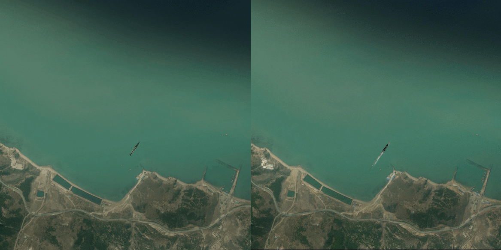

# SPAM-Controlnet

**Sim-to-Real Image-to-Image Translation for Remote Sensing Fine-Grained Ship Images Using Generative Diffusion Models**

---

## 📥 Dataset Download (FGSCR-SR-12)

We have newly added the download link for the **FGSCR-SR-12 dataset**.

**Baidu Cloud Link:**  
🔗 https://pan.baidu.com/s/1wtozDHnQ5Ef1BDB9G41oxA  
**Extraction Code:** `3vap`

A detailed dataset description and usage instructions will be added upon full public release.

---

## 🌐 Introduction
This repository contains the official implementation of our paper *"Sim-to-Real Image-to-Image Translation for Remote Sensing Fine-Grained Ship Images Using Generative Diffusion Models"*.

Remote sensing imagery of fine-grained ship objects is limited by scarce labeled data and large domain gaps between simulated and real-world scenes. To address these issues, we propose a novel **simulation-to-real (sim-to-real) pipeline** that decomposes the style-transfer problem into *foreground object generation* and *foreground–background harmonization*. This approach enables localized translation of fine-grained ship regions while maintaining global consistency of the background.

---

## 📊 Framework
The overall pipeline is illustrated in the following figure:

  

---

## 🎬 Example Results
The figure below shows style-transfer results of ship objects before and after our sim-to-real pipeline:

  

---

## 🚢 Contributions
Our main contributions are summarized as follows:

1. **Novel sim-to-real pipeline**: We decompose the style transfer into foreground object generation and image inpainting, enabling high-resolution synthesis with accurate geometry, realistic style, and harmonious background integration.  
2. **SPAM-ControlNet**: To overcome ControlNet’s limitations in local detail modeling, we propose the **Spatially Adaptive Mask (SPAM) ControlNet**, which modulates feature activations via dynamically predicted masks, enhancing fine-detail generation in ship regions.  
3. **Physics-guided ship wake model**: By using vessel parameters such as speed, length, and heading angle, we generate a wake-inpainting region. Stable Diffusion Inpainting is then applied to synthesize realistic wake patterns, achieving better harmonization and providing controllable, credible simulated data for downstream analysis.  
4. **Hybrid dataset (FGSCR-SR-12)**: We construct a dataset containing 12 ship classes (6 real-only and 6 real+synthetic), totaling **3663 images**, supporting fine-grained ship recognition tasks.  

---

## 📂 Repository Structure
- `assets/`  
  Contains the project figures and example GIF results.  
- `README.md`  
  Project documentation (this file).  
- `train/` *(to be released)*  
  Training scripts for SPAM-ControlNet.  
- `models/` *(to be released)*  
  Pre-trained models.  
- `dataset/` *(to be released)*  
  Instructions and download links for the FGSCR-SR-12 dataset.  

---

## 🔮 Future Release Plan
Since the paper is still under review, we will gradually release resources upon acceptance:
- [ ] Training and evaluation code.  
- [ ] Pre-trained SPAM-ControlNet weights.  
- [ ] Dataset preparation scripts and FGSCR-SR-12 dataset.  

